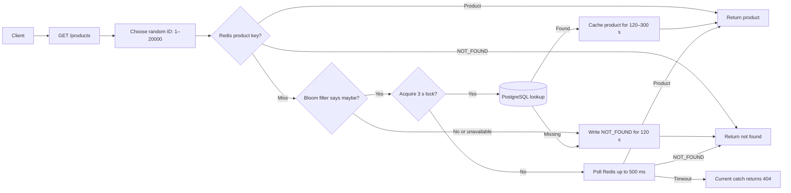

# Experiment Lab

> A NestJS experiment in layered caching: Redis product and negative caches, a RedisBloom existence filter, and per-key locks protecting PostgreSQL reads.

## The Problem

Repeated reads can overload PostgreSQL, concurrent misses can create a cache stampede, and repeated requests for IDs that do not exist can waste database queries. This project explores three ways to reduce that work: a product cache, a Bloom filter for likely existence checks, and a short-lived negative cache for missing IDs.

## The Current Approach

`GET /products` currently selects a random integer ID from `1` to `20000`. It checks Redis first, where either a serialized product or the `NOT_FOUND` sentinel may already be cached. On a cache miss, a RedisBloom filter screens IDs before the service attempts a database lookup. A per-product lock lets one request load and cache a possible product while competing requests briefly poll Redis.



The Bloom filter is reserved with a `0.1%` target false-positive rate and capacity of 10 million IDs. At application startup, existing product IDs are loaded into it from PostgreSQL in batches of 10,000. A Bloom “maybe” is not proof that a product exists; PostgreSQL remains the source of truth. The filter can also return false positives, which simply lead to a database lookup.

This is still an experiment, not a complete product API. The route does not accept a product ID. The request range is `1`–`20000`, while the bundled seeder creates 15,000 products, so a freshly seeded database has 5,000 IDs that are expected to be missing.

## Architecture

| Area                  | Responsibility                                                      |
| --------------------- | ------------------------------------------------------------------- |
| `src/products`        | Product model, HTTP route, Bloom-filter population, and lookup flow |
| `src/redis`           | Redis connection, product/negative cache, Bloom commands, and locks |
| `src/database`        | PostgreSQL connection through Sequelize                             |
| `database/migrations` | Product table schema                                                |
| `database/seeders`    | Inserts 15,000 sample products in batches                           |

Product cache entries expire after 120–300 seconds; `NOT_FOUND` entries expire after 120 seconds. The lock uses a unique token and a 3-second expiry. Requests that do not obtain the lock poll Redis 20 times at 25 ms intervals. Bloom initialization runs once during application bootstrap and scans the existing products table. RedisBloom commands (`BF.RESERVE`, `BF.MADD`, and `BF.EXISTS`) are required, so a plain Redis server without the RedisBloom module is not sufficient.

## Run Locally

### Prerequisites

- Node.js and npm
- PostgreSQL
- Redis with the RedisBloom module enabled (for example, Redis Stack)

Create a `.env` file in the project root and set the connection values for your local services:

```dotenv
PORT=3000

DB_HOST=localhost
DB_PORT=5432
DB_USERNAME=postgres
DB_PASSWORD=your-password
DB_DATABASE=experiment_lab

REDIS_HOST=localhost
REDIS_PORT=6379
```

Create the PostgreSQL database named in `DB_DATABASE` before running migrations. Then install dependencies, create the table, and load the sample data:

```bash
npm install
npm run db:migrate
npm run db:seed
npm run start:dev
```

The API listens on `http://localhost:3000` by default. Set `PORT` to use a different port.

### Useful Commands

| Command              | Purpose                               |
| -------------------- | ------------------------------------- |
| `npm run build`      | Compile the NestJS application        |
| `npm run lint`       | Lint source and test files            |
| `npm test`           | Run unit tests with Vitest            |
| `npm run test:e2e`   | Run end-to-end tests                  |
| `npm run db:migrate` | Compile and apply database migrations |
| `npm run db:seed`    | Compile and apply all seeders         |

## Blind Spots to Resolve

1. **What should happen when the Bloom filter is unavailable?** `mightExist()` returns `null`, but the product service treats `null` like a definite negative and writes `NOT_FOUND`. The Bloom service log says the database fallback will be used, but this path currently skips PostgreSQL. Should an unavailable filter bypass the filter and query the database?
2. **How should the Bloom filter stay current after startup?** It is populated from the database once at bootstrap. There are no product-write routes or ongoing refresh, so products inserted later may be absent from the filter and incorrectly negative-cached. Should writes update the filter, or should the filter be rebuilt on a schedule?
3. **What should happen when Redis is unavailable or another request holds the lock?** Cache and lock helpers fail closed; a lock loser waits for a cache entry rather than reading PostgreSQL. Is that the intended availability/consistency trade-off?
4. **Which HTTP status should cache-wait failures return?** `waitForCachedProduct()` throws `503` after its polling window, but `getProduct()` catches it and converts it to `404`. Should infrastructure/time-out errors preserve a `503` response?
5. **Should the ID range and seeded dataset agree?** Requests currently select IDs through `20000`, but the sample seeder inserts 15,000 products. Should the endpoint choose from existing IDs, accept an explicit ID, or intentionally exercise negative lookups?
6. **How should product cache entries be invalidated after product changes?** There are no write routes today, so a changed product can remain stale until its 120–300 second TTL expires.

## Current Scope

- One read-only route: `GET /products`.
- Product lookup uses a random integer ID in the range `1`–`20000`; the bundled seeder creates 15,000 products.
- Product entries expire after 120–300 seconds and negative entries after 120 seconds; there is no explicit product-update invalidation path.
- The Bloom filter is populated at startup and requires RedisBloom; no runtime update or periodic rebuild is implemented.
- Product writes, request validation, API documentation, and production observability are not implemented.
